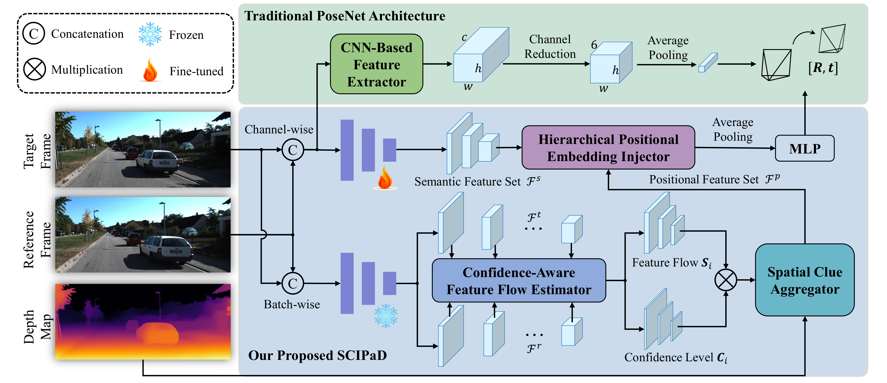

# SCIPaD

Official implementation of "SCIPaD: Incorporating Spatial Clues into Unsupervised Pose-Depth Joint Learning"(T-IV 2024).

[[paper]()] [[arxiv]()] [[website](https://mias.group/SCIPaD/)]

<p align="center">
  
</p>
An illustration of our proposed SCIPaD framework. Compared with the traditional PoseNet architecture, 
it comprises three main parts: (1) a confidence-aware feature flow estimator, (2) a spatial clue aggregator, 
and (3) a hierarchical positional embedding injector.

## ⚙️ Setup

Create a conda environment:

```shell
conda create -n scipad python==3.9
conda activate scipad
```

Install pytorch, torchvision and cuda:

```shell
conda install pytorch==2.0.1 torchvision==0.15.2 torchaudio==2.0.2 pytorch-cuda=11.7 -c pytorch -c nvidia
```

Install the dependencies:

```shell
pip install -r requirements.txt
```

Note that we ran our experiments with PyTorch 2.0.1, CUDA 11.7, Python 3.9 and Ubuntu 20.04.
It's acceptable to use a newer version of PyTorch, but the metrics might be slightly different
from those reported in the paper (~0.01%).

## 🖼️ Pretrained Models

You can download weights for pretrained models from the
[Google Drive](https://drive.google.com/drive/folders/1h758DqqwKVZataweu9sYu7jKiLn47eeq?usp=sharing) or
[Baidu Cloud Drive](https://pan.baidu.com/s/1-ydpphq7Snw0JIReVgq4-g?pwd=riyn):

| Methods   |   WxH   | abs rel | sq rel | RMSE  | RMSE log | $\delta < 1.25$ | $\delta < 1.25^2$ | $\delta < 1.25^3$ |
|:----------|:-------:|:-------:|:------:|:-----:|:--------:|:---------------:|:-----------------:|:-----------------:|
| KITTI Raw | 640x192 |  0.090  | 0.650  | 4.056 |  0.166   |      0.918      |       0.970       |       0.985       |

| Methods    |   WxH   | Seq09 $e_t$(%) | Seq09 $e_r$(%) | Seq09 ATE(m) | Seq10 $e_t$(%) | Seq10 $e_r$(%) | Seq10 ATE(m) |
|:-----------|:-------:|:--------------:|:--------------:|:------------:|:--------------:|:--------------:|:------------:|
| KITTI Odom | 640x192 |      7.43      |      2.46      |    26.15     |      9.82      |      3.87      |    15.51     |

Create a `./checkpoints/` folder and place the pretrained models inside it.

## 💾 Dataset Preparationasdf

* **KITTI Raw Dataset:**
  You can download the [KITTI raw dataset](https://www.cvlibs.net/datasets/kitti/raw_data.php) and convert the png
  images to jpeg following instructions in
  [Monodepth2](https://github.com/nianticlabs/monodepth2):

```shell
wget -i splits/kitti_archives_to_download.txt -P kitti_data/
cd kitti_data
unzip "*.zip"
cd ..
find kitti_data/ -name '*.png' | parallel 'convert -quality 92 -sampling-factor 2x2,1x1,1x1 {.}.png {.}.jpg && rm {}'
```

We also need pre-computed segmentation images provided by [TriDepth](https://github.com/xingyuuchen/tri-depth)
for training (not needed for evaluation).
Download them from [here](https://drive.google.com/file/d/1FNxJzGTfP1O_pUX9Va7d0dqZWtRi833X/view)
and organize the dataset as follows:

```
kitti_raw
├── 2011_09_26
│   ├── 2011_09_26_drive_0001_sync
│   ├── ...
│   ├── calib_cam_to_cam.txt
│   ├── calib_imu_to_velo.txt
│   └── calib_velo_to_cam.txt
├── ...
├── 2011_10_03
│   ├── ...
└── segmentation
    ├── 2011_09_26
    ├── ...
    └── 2011_10_03
```

* **KITTI Odometry Dataset:**
  Download the [KITTI odometry dataset](http://www.cvlibs.net/datasets/kitti/eval_odometry.php)
  **(color, 65GB)** and **ground truth poses** and organize the dataset as follows:

```
kitti_odom
├── poses
│   ├── 00.txt
│   ├── ...
│   └── 10.txt
└── sequences
    ├── 00
    ├── ...
    └── 21
```

## ⏳ Training

On KITTI Raw:

```shell
python train.py --config configs/kitti_raw.yaml
```

On KITTI Odometry:

```shell
python train.py --config configs/kitti_odom.yaml
```

### 🔧 Other training options

The [yacs](https://github.com/rbgirshick/yacs) configuration library is used in this project.
You can customize your configuration structure in ``./utils/config/defaults.py``
and configuration value in ``./configs/*.yaml``.

## 📊 KITTI evaluation

First, download KITTI ground truth and improved ground truth
from [here](https://drive.google.com/drive/folders/1x2EhfONnrbhkAel8UsPltTT9W2y1dsl6?usp=sharing), and put them into
the `./split/eigen` and `./split/eigen_benchmark`, respectively. You can also obtain them following instructions
provided in [Monodepth2](https://github.com/nianticlabs/monodepth2).

* Depth estimation results using the KITTI Eigen split:

```bash
python evaluate_depth.py --config configs/kitti_raw.yaml  load_weights_folder checkpoints/KITTI eval.batch_size 1
```

* Visual odometry evaluation pretrained weights to evaluate depth with eigen benchmark split:
* Depth estimation results using the improved KITTI ground truth:

```bash
python evaluate_depth.py --config configs/kitti_raw.yaml \
  load_weights_folder checkpoints/KITTI \
  eval.batch_size 1 \
  eval.split eigen_benchmark
```

* Visual odometry evaluation using Seqs. 09-10:

```bash
python evaluate_pose.py --config configs/kitti_odom.yaml \
  load_weights_folder checkpoints/KITTI_Odom \
  eval.split odom_09
python evaluate_pose.py --config configs/odom.yaml \
  load_weights_folder checkpoints/KITTI_Odom/ \
  eval.split odom_10
```

* To compute evaluation results and visualize trajectory, run:

```bash
python ./utils/kitti_odom_eval/eval_odom.py --result=checkpoints/KITTI_Odom/ --align='7dof'
```

You can refer to `./eval.sh` for more information.

## Citation

If you find our work useful in your research please consider citing our paper:

```
@inproceedings{feng2024scipad,
  title={SCIPaD: Incorporating Spatial Clues into Unsupervised Pose-Depth Joint Learning},
  author={Feng, Yi and Guo, Zizhan and Chen, Qijun and Fan, Rui},
  journal={IEEE Transactions on Intelligent Vehicles},
  year={2024},
  publisher={IEEE}
}
```
